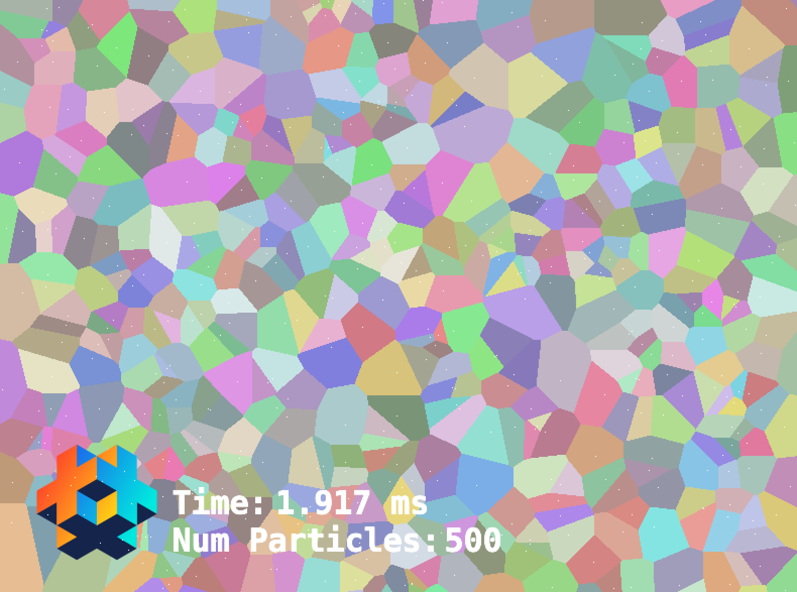

# defold-voronoi

A small extension for Defold to add 2D voronoi functionality

Uses the C/C++ library [jc_voronoi](https://github.com/JCash/voronoi) which
is a fast C implementation for creating 2D Voronoi diagrams from a point set.

Uses [Fortune's sweep algorithm.](https://en.wikipedia.org/wiki/Fortune%27s_algorithm)

Tested on iOS, OSX and Windows (should work fine on Android too)

Screenshot:

# Lua API

This extension adds a Lua module named `voronoi`

## voronoi.create(width, height)

Creates, and returns, a voronoi diagram context.

    self.diagram = voronoi.create(800, 600)

## voronoi.destroy(diagram)

Destroys a diagram context

## voronoi.generate(diagram, points)

Generates a 2D voronoi diagram from a set of 2D points
The `points` variable is a table with numbers: `{ x1, y1, x2, y2, ... }`

    local points = { 1.0, 1.5, 2.3, 3.1 }
    voronoi.generate(self.diagram, points } 

After generating the diagram, the results can be retrieved by `voronoi.get_site()`

## voronoi.get_num_sites(diagram)

Returns the number of valid sites. Note that some sites might
have been removed since they were duplicates.

## voronoi.get_site(diagram, index)

Gets a site and it's information.

- `index` - the index of the site in the original set of points

- `x` - the x value of the site's position

- `y` - the y value of the site's position

- `area` - the area of the voronoi cell

- `edges` - a list of the neighboring edges, where each edge is a table
and contains:

-- '1' = `{ x, y }` - The first point of the edge

-- '2' = `{ x, y }` - The second point of the edge

-- 'neighbor' - the index of the neighbor in the original set of points

Note that the edges are sorted, and are always rotated counter clockwise around the current site.

Here is an example of how to iterate the generated diagram:

    local num_sites = voronoi.get_num_sites(self.diagram)
    for i=1,num_sites do
        local site = voronoi.get_site(self.diagram, i)
        for ei, edge in pairs(site.edges) do
            if edge.neighbor > 0 then
                ...
            end
        end
    end

## voronoi.get_debug_image(diagram)

Gets an rgb image showing the diagram. The image is a buffer with the signature `{hash("rgb"), buffer_VALUE_TYPE_UINT8, 3}`

    self.textureheader = {width=self.width,
                        height=self.height,
                        type=resource.TEXTURE_TYPE_2D,
                        format=resource.TEXTURE_FORMAT_RGB,
                        num_mip_maps=1 }
    local path = go.get("#sprite", "texture0")
    local image = voronoi.get_debug_image(self.diagram)
    resource.set_texture(path, self.textureheader, image)
